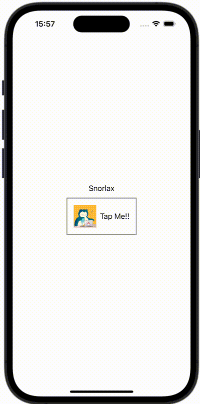
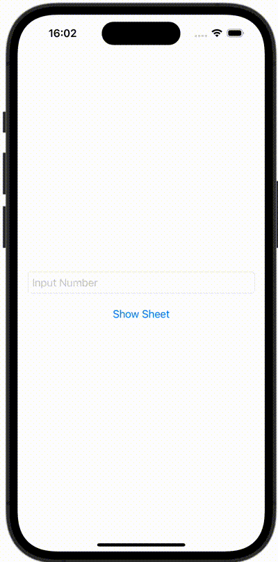
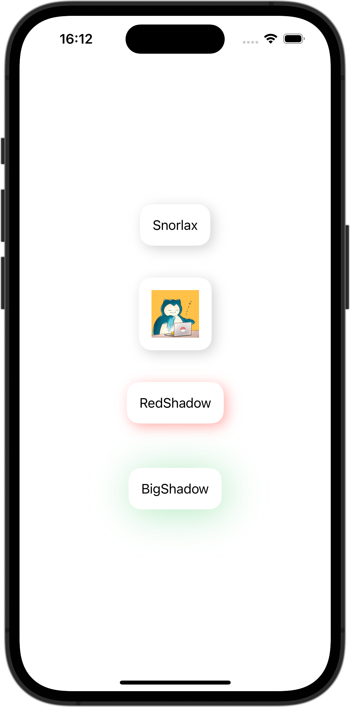
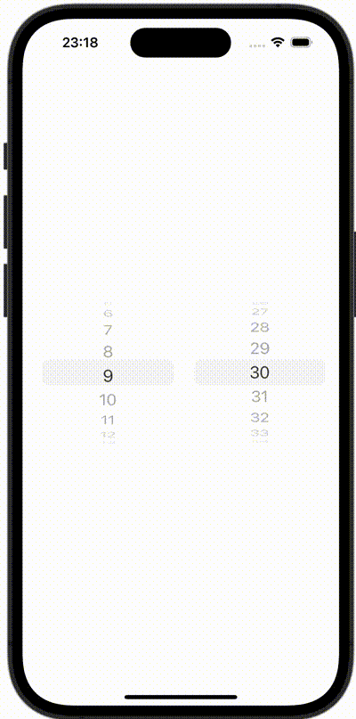
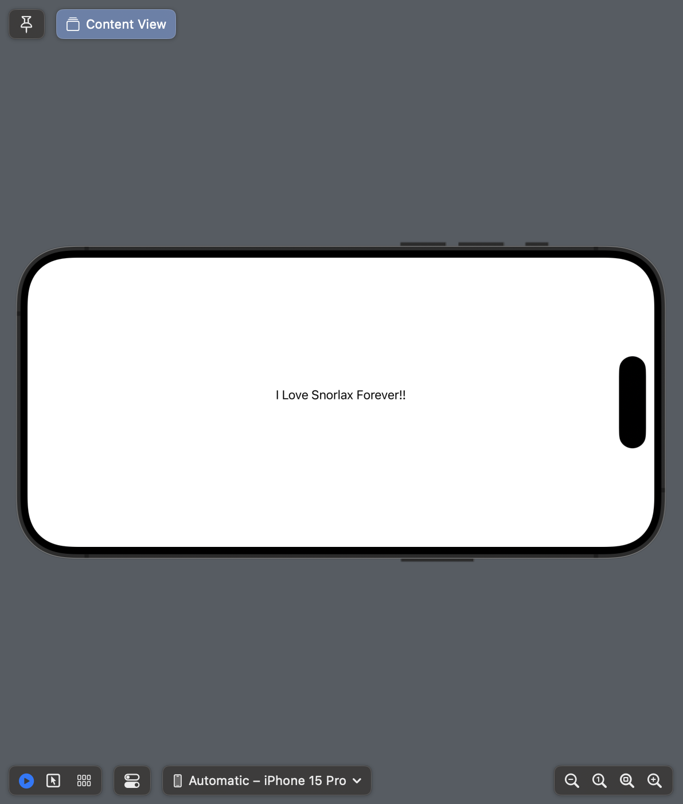

### 1. 画像をリサイズして表示（fit）
150×200サイズに画像をリサイズして表示させてください。
アスペクト比が異なる場合は余白を赤色で表示してください。


<details><summary>解答例</summary>
<div>

```swift
import SwiftUI

struct ContentView: View {
    var body: some View {
        Image(.icon)
            .resizable()
            .aspectRatio(contentMode: .fit)
            .frame(width: 150, height: 200)
            .background(Color.red)
    }
}

#Preview {
    ContentView()
}
```

</div>
</details>


### 2. 画像をリサイズして表示（clip）
150×200サイズに画像をリサイズして表示させてください。
アスペクト比が異なる場合ははみ出た箇所を切り取って表示してください。


<details><summary>解答例</summary>
<div>

```swift
import SwiftUI

struct ContentView: View {
    var body: some View {
        Image(.icon)
            .resizable()
            .scaledToFill()
            .frame(width: 150, height: 200)
            .clipped()
            .background(Color.red)
    }
}

#Preview {
    ContentView()
}
```

</div>
</details>


### 3. 画像を丸く切り取る
150✖︎150サイズに画像をリサイズし、丸く切り取って表示させてください。


<details><summary>解答例</summary>
<div>

```swift
import SwiftUI

struct ContentView: View {
    var body: some View {
        Image(.icon)
            .resizable()
            .aspectRatio(contentMode: .fill)
            .frame(width: 150, height: 150)
            .clipShape(Circle())
    }
}

#Preview {
    ContentView()
}
```

</div>
</details>


### 4. 画像を丸く切り取り、枠を付ける


<details><summary>解答例</summary>
<div>

```swift
import SwiftUI

struct ContentView: View {
    var body: some View {
        Image(.icon)
            .resizable()
            .scaledToFill()
            .frame(width: 150, height: 150)
            .cornerRadius(75)
            .overlay(
                RoundedRectangle(cornerRadius: 75).stroke(Color.black, lineWidth: 4)
            )
    }
}

#Preview {
    ContentView()
}
```

</div>
</details>


### 5. 画像を等間隔で横に並べる
画像を等間隔で並べてください。


<details><summary>解答例</summary>
<div>

```swift
import SwiftUI

struct ContentView: View {
    var body: some View {
        HStack {
            Image(.icon)
                .resizable()
                .frame(width: 42, height: 42)
            Spacer()
            Image(.icon)
                .resizable()
                .frame(width: 42, height: 42)
            Spacer()
            Image(.icon)
                .resizable()
                .frame(width: 42, height: 42)
            Spacer()
            Image(.icon)
                .resizable()
                .frame(width: 42, height: 42)
            Spacer()
            Image(.icon)
                .resizable()
                .frame(width: 42, height: 42)
        }
        .padding(16)
    }
}

#Preview {
    ContentView()
}
```

</div>
</details>


### 6. NavigationViewを使いラージタイトルを表示する
NavigationViewを使いラージタイトルを表示してください。


<details><summary>解答例</summary>
<div>

```swift
import SwiftUI

struct ContentView: View {
    var body: some View {
        NavigationStack {
            VStack {
                Image(.icon)
                    .resizable()
                    .frame(width: 150, height: 150)

                Text("Snorlax is the most plpular Pokemon")
            }
            .navigationBarTitleDisplayMode(.large)
            .navigationTitle("Snorlax")
        }
    }
}

#Preview {
    ContentView()
}
```

</div>
</details>


### 7. Pickerを表示する
Pickerを使いポケモンを表示してください。


<details><summary>解答例</summary>
<div>

```swift
import SwiftUI

struct ContentView: View {
    let pokemons = ["Snorlax", "Pikachu", "Slowpoke", "Meowth"]
    @State var selectedPokemon = 0

    var body: some View {
        Picker("Pokemon", selection: $selectedPokemon) {
            ForEach(pokemons, id: \.self) { pokemon in
                Text(pokemon)
            }
        }
        .pickerStyle(WheelPickerStyle())
        .onReceive([selectedPokemon].publisher.first()) { value in
            print("SelectedPokemon: \(value)")
            print(pokemons[value])
        }
    }
}

#Preview {
    ContentView()
}
```

</div>
</details>


### 8. TabViewを使って画面を切り替える
TabViewを使って画面を切り替えてください。


<details><summary>解答例</summary>
<div>

```swift
import SwiftUI

struct ContentView: View {
    var body: some View {
        TabView {
            Text("First Tab")
                .tabItem {
                    Image(systemName: "1.square.fill")
                    Text("First")
                }
            Text("Second Tab")
                .tabItem {
                    Image(systemName: "2.square.fill")
                    Text("Second")
                }
            Text("Third Tab")
                .tabItem {
                    Image(systemName: "3.square.fill")
                    Text("Third")
                }
        }
        .font(.headline)
    }
}

#Preview {
    ContentView()
}
```

</div>
</details>


### 9. Buttonが押されたら文字を変える
Buttonが押されたら文字を変えてください。


<details><summary>解答例</summary>
<div>

```swift
import SwiftUI

struct ContentView: View {
    @State var text = "Snorlax"

    var body: some View {
        VStack {
            Text(text)
            Button(action: {
                text = "Forever"
            }) {
                Text("Tap Me!!")
            }
        }
    }
}
```

</div>
</details>


### 10. Listを使ってセクションごとに表示する
Listを使ってセクションごとに表示する（groupedスタイル）


<details><summary>解答例</summary>
<div>

```swift
import SwiftUI

struct ContentView: View {
    var body: some View {
        List {
            Section("Normal") {
                Text("Meowth")
                Text("Ditto")
            }

            Section("Fire") {
                Text("Vulpix")
                Text("Arcanine")
                Text("Charmander")
            }
        }
        .listStyle(.grouped)
    }
}

#Preview {
    ContentView()
}
```

</div>
</details>


### 11. 画面遷移時に値を渡す
画面遷移時に値を渡してください。


<details><summary>解答例</summary>
<div>

```swift
import SwiftUI

struct ContentView: View {
    let fruits = ["Apple", "Banana", "Orange", "Grape", "Cherry", "Peach"]

    var body: some View {
        NavigationView {
            List(fruits, id: \.self) { fruit in
                NavigationLink(destination: SecondView(fruit: fruit)) {
                    Text(fruit)
                }
            }
        }
    }
}

#Preview {
    ContentView()
}
```

```swift
import SwiftUI

struct SecondView: View {
    let fruit: String

    var body: some View {
        Text(fruit)
    }
}

#Preview {
    SecondView(fruit: "Apple")
}
```

</div>
</details>


### 12. NavigationViewの戻るボタンを非表示にする
NavigationViewの戻るボタンを非表示にしてください。


<details><summary>解答例</summary>
<div>

```swift
import SwiftUI

struct ContentView: View {
    let fruits = ["Apple", "Banana", "Orange", "Grape", "Cherry", "Peach"]

    var body: some View {
        NavigationView {
            List(fruits, id: \.self) { fruit in
                NavigationLink(destination: SecondView(fruit: fruit)) {
                    Text(fruit)
                }
            }
        }
    }
}

#Preview {
    ContentView()
}
```

```swift
import SwiftUI

struct SecondView: View {
    let fruit: String

    var body: some View {
        Text(fruit)
            .navigationBarBackButtonHidden(true)
    }
}

#Preview {
    SecondView(fruit: "Apple")
}
```

</div>
</details>


### 13. Listのスタイルを変更する
ListのスタイルをPlainListStyleに変更してください。


<details><summary>解答例</summary>
<div>

```swift
import SwiftUI

struct ContentView: View {
    var body: some View {
        List {
            Section("Normal") {
                Text("Meowth")
                Text("Ditto")
            }

            Section("Fire") {
                Text("Vulpix")
                Text("Arcanine")
                Text("Charmander")
            }
        }
        .listStyle(.plain)
    }
}

#Preview {
    ContentView()
}
```

</div>
</details>


### 14. Alertを表示する
アラートを表示させてください。


<details><summary>解答例</summary>
<div>

```swift
import SwiftUI

struct ContentView: View {
    @State var showingAlert = false

    var body: some View {
        VStack {
            Button {
                showingAlert = true
            } label: {
                Text("Show Alert")
            }
        }
        .alert("Alert Title", isPresented: $showingAlert) {
            Button("Done", role: .none) {
                print("Done")
            }
            Button("Cancel", role: .cancel) {
                print("Cancel")
            }
        } message: {
            Text("Message")
        }
    }
}

#Preview {
    ContentView()
}
```

</div>
</details>


### 15. Alertを出し分ける
ボタン1が押されたらアラート1を、ボタン2が押されたらアラート2を表示してください


<details><summary>解答例</summary>
<div>

```swift
import SwiftUI

struct ContentView: View {
    @State var showingAlert = false
    @State var alertItem: AlertItem?

    var body: some View {
        VStack {
            Button {
                alertItem = AlertItem(buttonTitle: "Pikachu", message: "Pikachu is a fictional species in the Pokémon media franchise. ")
                showingAlert = true
            } label: {
                Text("Pikachu")
            }

            Button {
                alertItem = AlertItem(buttonTitle: "Snorlax", message: "Snorlax is most popular Pokémon.")
                showingAlert = true
            } label: {
                Text("Snorlax")
            }
        }
        .alert("Alert Title", isPresented: $showingAlert, presenting: alertItem) { alertItem in
            Button(alertItem.buttonTitle, role: .none) {
                print(alertItem.buttonTitle)
            }
        } message: { alertItem in
            Text(alertItem.message)
        }
    }
}

#Preview {
    ContentView()
}
```

```swift
import Foundation

struct AlertItem {
    let buttonTitle: String
    let message: String
}
```

</div>
</details>


### 16. Button内の画像やテキストの色を変えない
Buttonが押されたら文字を変えてください。
Button内の画像やテキストの色を変えないでください。



<details><summary>解答例</summary>
<div>

```swift
import SwiftUI

struct ContentView: View {
    @State var text = "Snorlax"

    var body: some View {
        VStack {
            Text(text)
            Button(action: {
                text = "Forever"
            }) {
                HStack {
                    Image(.icon)
                        .resizable()
                        .scaledToFill()
                        .frame(width: 50, height: 50)
                    Text("Tap Me!!")
                }
                .padding()
                .border(Color.gray, width: 2)
            }
            .buttonStyle(PlainButtonStyle())
        }
    }
}

#Preview {
    ContentView()
}
```

</div>
</details>


### 17. SwiftUIでアラートとシートを出し分ける
数字が入力されたらシートを表示してください。
数字以外が入力されたらアラートを表示してください。



<details><summary>解答例</summary>
<div>

```swift
import SwiftUI

struct ContentView: View {
    @State var numberString: String = ""
    @State var showingAlert: Bool = false
    @State var showingSheet: Bool = false

    var body: some View {
        VStack {
            TextField("Input Number", text: $numberString)
                .padding()
                .textFieldStyle(RoundedBorderTextFieldStyle())

            Button(action: {
                // Can numberString convert to Double?
                guard Double(numberString) != nil else {
                    showingAlert = true
                    return
                }
                showingSheet = true
            }) {
                Text("Show Sheet")
            }
        }
        .alert(Text("Error"), isPresented: $showingAlert, actions: {
            Button("Close", role: .none) {
                print("Close")
            }
        }, message: {
            Text("Please Input Number")
        })
        .sheet(isPresented: $showingSheet) {
            Text("\(numberString) can convert to Double")
        }
    }
}

#Preview {
    ContentView()
}
```

</div>
</details>


### 18. Buttonからプッシュ遷移をする（NavigationLinkを無効にする）
Buttonからプッシュ遷移をする方法です。 この方法であれば、NavigationLink を擬似的に無効にすることができます。


<details><summary>解答例</summary>
<div>

```swift
import SwiftUI

struct ContentView: View {
    @State var isActive: Bool = false

    var body: some View {
        NavigationStack {
            VStack {
                Button(action: {
                    isActive = true
                }) {
                    Text("Tap Me!!")
                }
            }
            .navigationDestination(isPresented: $isActive) {
                Text("SecondView")
            }
        }
    }
}

#Preview {
    ContentView()
}
```

</div>
</details>


### 19. 続きを読む。。。ボタンがあるViewを実装する
SwiftUIで続きを読む。。。ボタンがあるViewを実装してください。


<details><summary>解答例</summary>
<div>

```swift
import SwiftUI

struct ContentView: View {
    private let aliceInWonderland = "Alice was beginning to get very tired of sitting by her sister on the bank, and of having nothing to do: once or twice she had peeped into the book her sister was reading, but it had no pictures or conversations in it, “and what is the use of a book,” thought Alice “without pictures or conversations?”\nSo she was considering in her own mind (as well as she could, for the hot day made her feel very sleepy and stupid), whether the pleasure of making a daisy-chain would be worth the trouble of getting up and picking the daisies, when suddenly a White Rabbit with pink eyes ran close by her.\nThere was nothing so very remarkable in that; nor did Alice think it so very much out of the way to hear the Rabbit say to itself, “Oh dear! Oh dear! I shall be late!” (when she thought it over afterwards, it occurred to her that she ought to have wondered at this, but at the time it all seemed quite natural); but when the Rabbit actually took a watch out of its waistcoat-pocket, and looked at it, and then hurried on, Alice started to her feet, for it flashed across her mind that she had never before seen a rabbit with either a waistcoat-pocket, or a watch to take out of it, and burning with curiosity, she ran across the field after it, and fortunately was just in time to see it pop down a large rabbit-hole under the hedge."

    private let snorlax = "Snorlax is a huge, bipedal, dark blue-green Pokémon with a cream-colored face, belly, and feet. "

    private let flyMeToTheMoon = """
        Fly me to the moon
        Let me play among the stars
        Let me see what spring is like
        On a-Jupiter and Mars
        In other words, hold my hand
        In other words, baby, kiss me
        Fill my heart with song
        And let me sing for ever more
        You are all I long for
        All I worship and adore
        In other words, please be true
        In other words, I love you
        Fill my heart with song
        Let me sing for ever more
        You are all I long for
        All I worship and adore
        In other words, please be true
        In other words, in other words
        I love … you
        """

    var body: some View {
        ScrollView {
            VStack {
                ShowMoreView(text: aliceInWonderland)
                ShowMoreView(text: snorlax)
                ShowMoreView(text: flyMeToTheMoon)
            }
        }
    }
}

#Preview {
    ContentView()
}
```

```swift
import SwiftUI

struct ShowMoreView: View {
    @State var text: String
    @State var isFirst = true
    @State var isFold = false
    @State var needFoldButton = true
    @State var textHeight: CGFloat?

    var body: some View {
        VStack(alignment: .trailing) {
            HStack {
                Text(text)
                    .frame(height: textHeight)
                    .background(GeometryReader { geometory in
                        Color.clear.preference(key: SizePreference.self, value: geometory.size)
                    })
                    .padding()
                    .onPreferenceChange(SizePreference.self) { textSize in
                        if self.isFirst == true {
                            if textSize.height > 80 {
                                textHeight = 80
                                isFold = true
                                isFirst = false
                            } else {
                                needFoldButton = false
                            }
                        }
                    }
                Spacer()
            }

            if needFoldButton {
                Button(action: {
                    self.isFold.toggle()
                    if isFold == true {
                        textHeight = 80
                    } else {
                        textHeight = nil
                    }
                }) {
                    Text(isFold ? "More" : "Fold")
                }.padding(.trailing, 8)
            }
        }
    }
}

private struct SizePreference: PreferenceKey {
    static let defaultValue: CGSize = .zero
    static func reduce(value: inout CGSize, nextValue: () -> CGSize) {}
}
```

</div>
</details>


### 20. Text中の文字の太さや色を変える
Text中の文字の太さや色を変えてください。


<details><summary>解答例</summary>
<div>

```swift
import SwiftUI

struct ContentView: View {
    var body: some View {
        VStack {
            Text("I")
                .font(.system(size: 20).bold())
            + Text(" ❤️ ")
                .foregroundStyle(Color.red)
            + Text("Snorlax")
                .foregroundStyle(Color.black)
                .font(.system(size: 20).bold())
            + Text("!\n")
            + Text("Snorlax ")
                .foregroundStyle(Color.red)
                .font(.system(size: 20).bold())
            + Text("is most ")
                .foregroundStyle(Color.blue)
                .font(.system(size: 20).bold())
            + Text("cute & cool& powerful .")
                .foregroundStyle(Color.green)
                .font(.system(size: 20).bold())
            + Text("Pokemon.")
                .foregroundStyle(Color.yellow)
                .font(.system(size: 20).bold())
        }
    }
}

#Preview {
    ContentView()
}
```

</div>
</details>


### 21. FunctionBuilderを使ってViewに影をつける
FunctionBuilderを使ってViewに影をつけてください。



<details><summary>解答例</summary>
<div>

```swift
import SwiftUI

struct ContentView: View {
    var body: some View {
        VStack {
            CardView {
                Text("Snorlax")
            }

            CardView {
                Image(.icon)
                    .resizable()
                    .frame(width: 60, height: 60)
            }

            CardView(color: Color.red.opacity(0.4)) {
                Text("RedShadow")
            }

            CardView(
                color: Color.green.opacity(0.4),
                radius: 24) {
                    Text("BigShadow")
            }
        }
    }
}

#Preview {
    ContentView()
}

```

```swift
import SwiftUI

struct CardView<Content>: View where Content: View {
    let color: Color
    let radius: CGFloat
    let content: () -> Content

    init(
        color: Color = Color.gray.opacity(0.4),
        radius: CGFloat = 8,
        @ViewBuilder content: @escaping () -> Content) {
        self.content = content
        self.color = color
        self.radius = radius
    }

    var body: some View {
        content()
        .padding(16)
        .background(Color.white)
        .cornerRadius(16)
        .shadow(color: color, radius: radius, x: 4, y: 4)
        .padding(radius + 8)
    }
}
```

</div>
</details>


### 22. ViewModifierを使ってViewに影をつける
ViewModifierを使ってViewに影をつけてください。


<details><summary>解答例</summary>
<div>

```swift
import SwiftUI

struct ContentView: View {
    var body: some View {
        VStack {
            Text("Snorlax")
                .card()

            Image(.icon)
                .resizable()
                .frame(width: 60, height: 60)
                .card()

            Text("RedShadow")
                .card(color: Color.red.opacity(0.4))

            Text("BigShadow")
                .card(
                    color: Color.green.opacity(0.4),
                    radius: 24)
        }
    }
}

#Preview {
    ContentView()
}
```

```swift
import SwiftUI

struct CardViewModifier: ViewModifier {
    let color: Color
    let radius: CGFloat
    func body(content: Content) -> some View {
        content
            .padding(16)
            .background(Color.white)
            .cornerRadius(16)
            .shadow(color: color, radius: radius, x: 4, y: 4)
            .padding(radius + 8)
    }
}
```

```swift
import SwiftUI

extension View {
    func card(
        color: Color = Color.gray.opacity(0.4),
        radius: CGFloat = 8) -> some View {
            self.modifier(CardViewModifier(color: color, radius: radius))
        }
}
```

</div>
</details>


### 23. リストを編集する
リストを編集してください。


<details><summary>解答例</summary>
<div>

```swift
import SwiftUI

struct ContentView: View {
    @State private var users = ["Paul", "Taylor", "Adele"]

    var body: some View {
        NavigationView {
            List {
                ForEach(users, id: \.self) { user in
                    Text(user)
                }
                .onDelete(perform: delete)
            }
            .navigationBarItems(trailing: EditButton())
        }
    }

    func delete(at offsets: IndexSet) {
        users.remove(atOffsets: offsets)
    }
}

#Preview {
    ContentView()
}
```

</div>
</details>


### 24. リストのセルをタップするとアラートが表示させる
リストのセルをタップするとアラートが表示させてください。


<details><summary>解答例</summary>
<div>

```swift
import SwiftUI

struct ContentView: View {
    @State var showingAlert = false
    @State var pokemon: Pokemon?

    let pokemons: [Pokemon] = [
        Pokemon(id: 143, name: "Snorlax"),
        Pokemon(id: 25, name: "Pikachu"),
        Pokemon(id: 138, name: "Psyduck"),
        Pokemon(id: 9, name: "Blastoise"),
        Pokemon(id: 79, name: "Slowpoke")]

    var body: some View {
        List(pokemons) { pokemon in
            Button {
                self.pokemon = pokemon
                showingAlert = true
            } label: {
                Text(pokemon.name)
            }
        }
        .alert("Alert", isPresented: $showingAlert, presenting: pokemon) { pokemon in
            Button(pokemon.name, role: .none) {
                print("Close")
            }
        } message: { pokemon in
            Text(pokemon.name)
        }
    }
}

#Preview {
    ContentView()
}
```

```swift
import Foundation

struct Pokemon: Identifiable {
    let id: Int
    let name: String
}
```

</div>
</details>


### 25. 画面遷移先のViewから遷移元のメソッドを呼び出す
画面遷移先の View から遷移元のメソッドを呼び出してください。


<details><summary>解答例</summary>
<div>

```swift
import SwiftUI

struct ContentView: View, MyProtocol {
    @State var text: String = "My Text"
    var body: some View {
        NavigationView {
            VStack {
                Text(text)
                NavigationLink(destination: SecondView(delegate: self)) {
                    Text("2nd View")
                }
            }
        }
    }

    func myFunc() {
        text = "Changed Text"
    }
}

struct SecondView: View {
    var delegate: MyProtocol
    var body: some View {
        Button(action: {
            self.delegate.myFunc()
        }) {
            Text("ChangeText")
        }
    }
}
```

```swift
import SwiftUI

struct SecondView: View {
    var delegate: MyProtocol
    var body: some View {
        Button(action: {
            delegate.myFunc()
        }) {
            Text("ChangeText")
        }
    }
}
```

```swift
import Foundation

protocol MyProtocol {
    func myFunc()
}
```

</div>
</details>


### 26. ListViewからそれぞれ別のViewに遷移する
ListViewからそれぞれ別のViewに遷移する


<details><summary>解答例</summary>
<div>

```swift
import SwiftUI

struct ContentView: View {
    @State var selectedHour = 8
    @State var selectedMinute = 30

    var body: some View {
        GeometryReader { geometry in
            HStack {
                Picker(selection: $selectedHour, label: EmptyView()) {
                    ForEach(0 ..< 24) {
                        Text("\($0)")
                    }
                }
                .pickerStyle(WheelPickerStyle())
                .onReceive([selectedHour].publisher.first()) { (value) in
                    print("hour: \(value)")
                }.labelsHidden()
                    .frame(width: geometry.size.width / 2, height: geometry.size.height)
                    .clipped()

                Picker(selection: $selectedMinute, label: EmptyView()) {
                    ForEach(0 ..< 60) {
                        Text("\($0)")
                    }
                }
                .pickerStyle(WheelPickerStyle())
                .onReceive([selectedMinute].publisher.first()) { value in
                    print("minute: \(value)")
                }
                .labelsHidden()
                .frame(width: geometry.size.width / 2, height: geometry.size.height)
                .clipped()
            }
        }
        .padding()
    }
}

#Preview {
    ContentView()
}
```

</div>
</details>


### 27. 複数行のPickerを作成する
複数行のPickerを作成する



<details><summary>解答例</summary>
<div>

```swift
import SwiftUI

struct ContentView: View {
    @State var showingSheet = false
    var body: some View {
        VStack {
            Button(action: {
                showingSheet = true
            }) {
                Text("Tap me!")
            }
        }
        .sheet(isPresented: $showingSheet) {
            Text("Sheet!!")
        }
    }
}

#Preview {
    ContentView()
}
```

</div>
</details>


### 28. Sheetを表示する
Sheetを表示する


<details><summary>解答例</summary>
<div>

```swift
import SwiftUI

struct ContentView: View {
    @State var showingSheet = false
    var body: some View {
        VStack {
            Button(action: {
                showingSheet = true
            }) {
                Text("Tap me!")
            }
        }
        .sheet(isPresented: $showingSheet) {
            Text("Sheet!!")
        }
    }
}

#Preview {
    ContentView()
}
```

```swift
import SwiftUI

struct SecondView: View {
    @Environment(\.dismiss) var dismiss

    var body: some View {
        VStack {
            Button(action: {
                dismiss()
            }) {
                Text("Dismiss")
            }
        }
        .frame(maxWidth: .infinity, maxHeight: .infinity)
        .background(Color.white)
    }
}

#Preview {
    SecondView()
}
```

</div>
</details>


### 29. 全画面でSheetを表示する
全画面でSheetを表示してください。


<details><summary>解答例</summary>
<div>

```swift
import SwiftUI

struct ContentView: View {
    @State var showingCover = false
    var body: some View {
        VStack {
            Button(action: {
                showingCover = true
            }) {
                Text("Tap me!")
            }
        }
        .frame(maxWidth: .infinity, maxHeight: .infinity)
        .background(Color.gray)
        .fullScreenCover(isPresented: $showingCover) {
            SecondView()
        }
    }
}

#Preview {
    ContentView()
}

```

```swift
import SwiftUI

struct SecondView: View {
    @Environment(\.dismiss) var dismiss

    var body: some View {
        VStack {
            Button(action: {
                dismiss()
            }) {
                Text("Dismiss")
            }
        }
        .frame(maxWidth: .infinity, maxHeight: .infinity)
        .background(Color.white)
    }
}

#Preview {
    SecondView()
}
```

</div>
</details>


### 30. NavigationBarを隠す
TextをNavigationViewの中に入れつつNavigationBarを表示しないでください


<details><summary>解答例</summary>
<div>

```swift
import SwiftUI

struct ContentView: View {
    var body: some View {
        NavigationStack {
            Text("No Navigation Bar")
                .navigationBarTitle("Not Showing Title")
                .navigationBarHidden(true)
        }
    }
}

#Preview {
    ContentView()
}
```

</div>
</details>


### 31. Previewを横向きにする
Previewを横向きにしてください。



<details><summary>解答例</summary>
<div>

```swift
import SwiftUI

struct ContentView: View {
    var body: some View {
        Text("I Love Snorlax Forever!!")
    }
}

struct ContentView_Previews: PreviewProvider {
    static var previews: some View {
        ContentView()
            .previewInterfaceOrientation(.landscapeLeft)
    }
}
```

</div>
</details>


### 32. 端末のシェイクを検知する
端末のシェイクを検知して@Stateを更新してください


<details><summary>解答例</summary>
<div>

```swift
import SwiftUI

struct ContentView: View {
    @State var message = "Shake Me"

    var body: some View {
        Text(message)
            .onReceive(NotificationCenter.default.publisher(for: .deviceDidShakeNotification)) { _ in
                message = "Device Did Shake"
        }
    }
}

#Preview {
    ContentView()
}
```

```swift
import Foundation

extension NSNotification.Name {
    public static let deviceDidShakeNotification = NSNotification.Name("DeviceDidShakeNotification")
}
```

```swift
import Foundation

extension UIWindow {
    open override func motionEnded(_ motion: UIEvent.EventSubtype, with event: UIEvent?) {
        super.motionEnded(motion, with: event)
        NotificationCenter.default.post(name: .deviceDidShakeNotification, object: event)
    }
}
```

</div>
</details>


### 33. UICollectionViewのようにViewを並べる
UICollectionViewのようにViewを並べてください。


<details><summary>解答例</summary>
<div>

```swift
import SwiftUI

struct ContentView: View {
    let columns = [GridItem(.fixed(80)), GridItem(.fixed(80)), GridItem(.fixed(80)), GridItem(.fixed(80))]

    var body: some View {
        ScrollView {
            LazyVGrid(columns: columns) {
                ForEach(0..<100, id: \.self) { number in
                    Text("\(number)")
                        .foregroundStyle(Color.white)
                        .font(.title)
                        .frame(width: 80, height: 80)
                        .background(Color.gray)
                }
            }
        }
    }
}

#Preview {
    ContentView()
}
```

</div>
</details>


### 34. スワイプで遷移するチュートリアル画面を作る
画像のような良くあるウェークスルー画面を実装してください。


<details><summary>解答例</summary>
<div>

```swift
import SwiftUI

struct ContentView: View {
    var body: some View {
        TabView {
            ContentViewCell(imageName: "snorlax")
            ContentViewCell(imageName: "magnemite")
            ContentViewCell(imageName: "psyduck")
            ContentViewCell(imageName: "quagsire")
            ContentViewCell(imageName: "slowpoke")
        }
        .frame(maxWidth: .infinity, maxHeight: .infinity)
        .background(Color.gray)
        .tabViewStyle(.page)
        .menuIndicator(.visible)
    }
}

#Preview {
    ContentView()
}
```

</div>
</details>


### 35. 閉じることができないモーダルを表示する


<details><summary>解答例</summary>
<div>

```swift
import SwiftUI

struct ContentView: View {
    @State var showingSheet = false
    var body: some View {
        
        Button(action: {
            showingSheet = true
        }, label: {
            Text("Show Modal!")
        })
        .sheet(isPresented: $showingSheet) {
            ModalView()
        }
    }
}

#Preview {
    ContentView()
}
```

</div>
</details>


### 36. アプリ起動時に画面を遷移させる
ロゴを表示した後に画面遷移を行なってください


<details><summary>解答例</summary>
<div>

```swift
import SwiftUI

struct ContentView: View {
    @State var viewType: ViewType = .launch
    
    var body: some View {
        ZStack {
            switch viewType {
            case .launch:
                Text("Launch")
            case .home:
                Text("Home")
            }
        }
        .onAppear {
            Task {
                try? await sleep()
                withAnimation(.linear(duration: 0.5)) {
                    viewType = .home
                }
            }
        }
    }
    
    func sleep() async throws {
        // sleep 2sec
        _ = try await Task.sleep(nanoseconds: 2_000_000_000)
    }
}

#Preview {
    ContentView()
}
```

</div>
</details>


### 37. ハーフモーダルを表示する


<details><summary>解答例</summary>
<div>

```swift
import SwiftUI

struct ContentView: View {
    @State var showingSheet = false
    var body: some View {
        
        Button(action: {
            showingSheet = true
        }, label: {
            Text("Show Modal!")
        })
        .sheet(isPresented: $showingSheet) {
            Text("Half Modal")
                .presentationDetents([.medium])
            
        }
    }
}

#Preview {
    ContentView()
}
```

</div>
</details>


### 38. マークダウンを表示する


<details><summary>解答例</summary>
<div>

```swift
import SwiftUI

struct ContentView: View {
    var body: some View {
        Text("**Snorlax** is the **most** cute pokemon!\n[About Snorlax](https://en.wikipedia.org/wiki/Snorlax)")
    }
}

#Preview {
    ContentView()
}
```

</div>
</details>


### 39. 変数に格納したマークダウンを表示する


<details><summary>解答例</summary>
<div>

```swift
import SwiftUI

struct ContentView: View {
    let markdownText: String = "**Snorlax** is the **most** cute pokemon!\n[About Snorlax](https://en.wikipedia.org/wiki/Snorlax)"
    
    var body: some View {
        Text(LocalizedStringKey(markdownText))
    }
}

#Preview {
    ContentView()
}

```

</div>
</details>


### 40. マークダウンのリンクの色を赤色に変える


<details><summary>解答例</summary>
<div>

```swift
import SwiftUI

struct ContentView: View {
    let markdownText: String = "**Snorlax** is the **most** cute pokemon!\n[About Snorlax](https://en.wikipedia.org/wiki/Snorlax)"
    
    var body: some View {
        Text(LocalizedStringKey(markdownText))
            .tint(Color.red)
    }
}

#Preview {
    ContentView()
}
```

</div>
</details>


### 41. GithubのAPIを叩き、リポジトリの情報をリストに表示する（async, await）


<details><summary>解答例</summary>
<div>

```swift
import SwiftUI

struct ContentView: View {
    @State var repositories: [Repository] = []
    @State var showingErrorAlert = false
    
    let gitHubAPIRepository = GitHubAPIRepository()
    
    var body: some View {
            List(repositories) { repository in
                VStack(alignment: .leading) {
                    Text(repository.name)
                        .font(Font.system(size: 24).bold())
                    Text(repository.description ?? "")
                    Text("Star: \(repository.stargazersCount)")
                }
            }.onAppear {
                fetchRepositories()
            }
            .alert("Error", isPresented: $showingErrorAlert) {
                Button("Close", action: {})
            } message: {
                Text("Failed to Fetch repositories.")
            }

    }
    
    @MainActor
    func fetchRepositories() {
        Task {
            do {
                repositories = try await gitHubAPIRepository.searchRepos(page:1, perPage: 20)
            } catch {
                showingErrorAlert = true
            }
        }
    }
}

#Preview {
    ContentView()
}
```

</div>
</details>


### 42. GithubのAPIを叩き、リポジトリの情報をリストに表示する。一番下までスクロールされたら追加で取得してください。


<details><summary>解答例</summary>
<div>

```swift
import SwiftUI

struct ContentView: View {
    @State var repositories: [Repository] = []
    @State var page = 1
    @State var isFetching = false
    @State var showingErrorAlert = false

    let gitHubAPIRepository = GitHubAPIRepository()
    
    var body: some View {
            List(repositories) { repository in
                VStack(alignment: .leading) {
                    Text(repository.name)
                        .font(Font.system(size: 24).bold())
                    Text(repository.description ?? "")
                    Text("Star: \(repository.stargazersCount)")
                }
                .onAppear {
                    if repositories.last == repository {
                        fetchRepositories()
                    }
                }
            }.onAppear {
                fetchRepositories()
            }
            .alert("Error", isPresented: $showingErrorAlert) {
                Button("Close", action: {})
            } message: {
                Text("Failed to Fetch repositories.")
            }

    }
    
    @MainActor
    func fetchRepositories() {
        if isFetching {
            return
        }
        isFetching = true
        
        Task {
            do {
                repositories += try await gitHubAPIRepository.searchRepos(page: page, perPage: 20)
                page += 1
                isFetching = false
            } catch {
                isFetching = false
                showingErrorAlert = true
            }
        }
    }
}

#Preview {
    ContentView()
}
```

</div>
</details>


### 43. GithubのAPIを叩き、リポジトリの情報をリストに表示する。一番下までスクロールされたら追加で取得してください。Indicator も表示してください。


<details><summary>解答例</summary>
<div>

```swift
import SwiftUI

struct ContentView: View {
    @State var repositories: [Repository] = []
    @State var page = 1
    @State var isFetching = false
    @State var showingErrorAlert = false
    
    let gitHubAPIRepository = GitHubAPIRepository()
    
    var body: some View {
        List {
            ForEach(repositories) { repository in
                VStack(alignment: .leading) {
                    Text(repository.name)
                        .font(Font.system(size: 24).bold())
                    Text(repository.description ?? "")
                    Text("Star: \(repository.stargazersCount)")
                }
                .onAppear {
                    if repositories.last == repository {
                        fetchRepositories()
                    }
                }
            }
            
            HStack {
                if isFetching {
                    Spacer()
                    ProgressView()
                    Spacer()
                }
            }
        }
        .onAppear {
            fetchRepositories()
        }
        .alert("Error", isPresented: $showingErrorAlert) {
            Button("Close", action: {})
        } message: {
            Text("Failed to Fetch repositories.")
        }
    }
    
    @MainActor
    func fetchRepositories() {
        if isFetching {
            return
        }
        isFetching = true
        
        Task {
            do {
                repositories += try await gitHubAPIRepository.searchRepos(page: page, perPage: 20)
                page += 1
                isFetching = false
            } catch {
                isFetching = false
                showingErrorAlert = true
            }
        }
    }
}

#Preview {
    ContentView()
}
```

</div>
</details>


### 44. SwiftUIのTextFieldで編集中と編集完了を検知する


<details><summary>解答例</summary>
<div>

```swift
import SwiftUI

struct ContentView : View {
    @State var userName: String = ""
    @State var onEditing: Bool = false
    
    var body: some View {
        VStack {
            Text(onEditing ? "On Editing" : "Not On Editing")
            
            TextField("Placeholder", text: $userName, onEditingChanged: { onEditing in
                print("onEditingChanged: \(onEditing)")
                self.onEditing = onEditing
            }, onCommit: {
                print("onCommit")
            })
            .textFieldStyle(RoundedBorderTextFieldStyle())
            .padding()
        }
    }
}

#Preview {
    ContentView()
}
```

</div>
</details>


### 45. SwiftUIでAppStorageを使ってUserDefaultの値を監視する


<details><summary>解答例</summary>
<div>

```swift
import SwiftUI

struct ContentView: View {
    @AppStorage("FAVORITE_POKEMON_NAME") var favoritePokemonName: String = ""

    var body: some View {
        VStack(spacing: 16) {
            Text("Your favorite pokemon is, \(favoritePokemonName)")

            Button("Snorlax is my mavorite pokemon.") {
                favoritePokemonName = "Snorlax"
            }
            
            Button("Slowpoke is my mavorite pokemon.") {
                UserDefaults.standard.set("Slowpoke", forKey: "FAVORITE_POKEMON_NAME")
            }
        }
    }
}

#Preview {
    ContentView()
}
```

</div>
</details>


### 46. SwiftUIでViewの上にViewを重ねる


<details><summary>解答例</summary>
<div>

```swift
import SwiftUI

struct ContentView: View {
    var body: some View {
        Image(.icon)
            .resizable()
            .frame(width: 200, height: 200)
            .overlay(
                Text("@takoikatakotako")
                    .foregroundColor(Color.white)
                    .font(Font.system(size: 20).bold())
                    .frame(minWidth: 0, maxWidth: .infinity, minHeight: 0, maxHeight: .infinity)
                    .background(Color.black)
                    .opacity(0.5)
            )
    }
}

#Preview {
    ContentView()
}
```

</div>
</details>


### 47. SwiftUIでMapを使う。Mapにピンを立てる(skip)


<details><summary>解答例</summary>
<div>

```swift
import Foundation
```

</div>
</details>


### 48. SwiftUIを使ったTODOアプリのサンプル


<details><summary>解答例</summary>
<div>

```swift
import SwiftUI

struct ContentView: View, InputViewDelegate {
    @State var todos: [String] = []
    
    var body: some View {
        NavigationView {
            ZStack(alignment: .bottomTrailing) {
                List {
                    ForEach(todos, id: \.self) { user in
                        Text(user)
                    }
                    .onDelete(perform: delete)
                }
                .listStyle(.plain)
                
                NavigationLink(destination: InputView(delegate: self, text: "")) {
                    Text("Add")
                        .foregroundColor(Color.white)
                        .font(Font.system(size: 20))
                }
                .frame(width: 60, height: 60)
                .background(Color.orange)
                .cornerRadius(30)
                .padding()
                
            }
            .onAppear {
                if let todos = UserDefaults.standard.array(forKey: "TODO") as? [String] {
                    self.todos = todos
                }
            }
            .navigationTitle("TODO")
            .navigationBarItems(trailing: EditButton())
        }
    }
    
    func delete(at offsets: IndexSet) {
        todos.remove(atOffsets: offsets)
        UserDefaults.standard.setValue(todos, forKey: "TODO")
    }
    
    func addTodo(text: String) {
        todos.append(text)
        UserDefaults.standard.setValue(todos, forKey: "TODO")
    }
}

#Preview {
    ContentView()
}
```

</div>
</details>


### 49. SwiftUIでAVAudioPlayerで音楽を再生し、再生終了を検知する


<details><summary>解答例</summary>
<div>

```swift
import SwiftUI

struct ContentView: View {
    @StateObject var viewModel = ContentViewState()
    var body: some View {
        VStack {
            Button("Play") {
                viewModel.playAudio()
            }
        }
    }
}

#Preview {
    ContentView()
}
```

</div>
</details>


### 50. SwiftUIでモーダルを表示する時に値を渡す


<details><summary>解答例</summary>
<div>

```swift
import SwiftUI

struct ContentView: View {
    @State var name = ""
    @State var showingSheet = false
    
    var body: some View {
        VStack(spacing: 16) {
            TextField("Input Name", text: $name)
                .textFieldStyle(RoundedBorderTextFieldStyle())
                .padding()
            Text("Name: \(name)")

            Button {
                showingSheet = true
            } label: {
                Text("Show Modal")
                    .font(Font.system(size: 20))
                    .foregroundColor(Color.white)
                    .padding(16)
                    .background(Color.gray)
                    .cornerRadius(16)
            }
            .sheet(isPresented: $showingSheet) {
                PokemonView(pokemonName: name)
            }
        }
    }
}

#Preview {
    ContentView()
}
```

</div>
</details>


### 51. SwiftUIでBMIを計算し、結果を別のViewで表示する


<details><summary>解答例</summary>
<div>

```swift
import SwiftUI

struct ContentView: View {
    @State var height: String = ""
    @State var weight: String = ""
    @State var bmi: Double = 0
    @State var showingSheet = false
    
    var body: some View {
        VStack {
            VStack(alignment: .leading) {
                Text("Height")
                TextField("Input Your Height", text: $height)
                    .keyboardType(.numberPad)
                    .padding()
                    .border(Color.black, width: 1)
            }
            .padding()
            
            VStack(alignment: .leading) {
                Text("Height")
                TextField("Input Your Weight", text: $weight)
                    .keyboardType(.numberPad)
                    .padding()
                    .border(Color.black, width: 1)
            }
            .padding()
            
            Button(action: {
                guard let height = Double(self.height),
                      let weight = Double(self.weight) else {
                    print("Fail to Calc BMI")
                    return
                }
                
                // Calc BMI
                bmi = weight / (height / 100) / (height / 100)
                
                // Show Sheet
                showingSheet = true
            }, label: {
                Text("Calc BMI")
                    .font(.title)
                    .foregroundColor(Color.black)
                    .padding()
                    .background(Color(UIColor.lightGray))
                    .cornerRadius(16)
            })
        }
        .sheet(isPresented: $showingSheet) {
            ResultView(bmi: $bmi)
        }
    }
}

#Preview {
    ContentView()
}
```

</div>
</details>


### 52. SwiftUIでボタンを押すとポップアップを表示する


<details><summary>解答例</summary>
<div>

```swift
import SwiftUI

struct ContentView: View {
    @State var showingPopUp = false
    var body: some View {
        ZStack {
            Button(action: {
                withAnimation {
                    showingPopUp = true
                }
            }, label: {
                Text("Tap Me!!")
                    .padding()
                    .background(Color.white)
                    .cornerRadius(12)
            })
            
            if showingPopUp {
                PopupView(isPresent: $showingPopUp)
            }
        }
        .frame(minWidth: 0, maxWidth: .infinity, minHeight: 0, maxHeight: .infinity)
        .background(Color.gray)
        .ignoresSafeArea()
    }
}

#Preview {
    ContentView()
}
```

</div>
</details>


### 53. SwiftUIでViewを横スクロールで表示する


<details><summary>解答例</summary>
<div>

```swift
import SwiftUI

struct ContentView: View {
    var body: some View {
        let pokemons = ["pikachu", "slowpoke", "bellsprout", "ditto", "snorlax", "eevee", "magikarp"]
        
        ScrollView(.horizontal, showsIndicators: false) {
            LazyHStack(spacing: 12) {
                ForEach(pokemons, id: \.self) { pokemon in
                    Image(pokemon)
                        .resizable()
                        .frame(width: 80, height: 80)
                        .background(Color(UIColor.lightGray))
                }
            }
            .padding(.horizontal, 12)
        }
        .frame(height: 80)
    }
}

#Preview {
    ContentView()
}
```

</div>
</details>


### 54. SwiftUIでButtonを有効にしたり無効にしたりする


<details><summary>解答例</summary>
<div>

```swift
import SwiftUI

struct ContentView: View {
    @State var enable: Bool = true
    
    var body: some View {
        VStack {
            Toggle(isOn: $enable) {
                Text("isEnable: \(enable.description)")
            }
            
            Button {
                print("Tapped!!")
            } label: {
                Text("Tap Me!!(\(enable ? "Enable": "Disable"))")
                    .foregroundColor(Color.white)
                    .padding()
                    .background(enable ? Color.orange: Color(UIColor.lightGray))
            }
            .disabled(!enable)
        }.padding()
    }
}

#Preview {
    ContentView()
}
```

</div>
</details>


### 55. SwiftUIのTextFieldで表示するキーボードを指定する


<details><summary>解答例</summary>
<div>

```swift
import SwiftUI

struct ContentView: View {
    @State var numberString = ""
    
    var body: some View {
        TextField("Input Number", text: $numberString)
            .keyboardType(.decimalPad)
            .textFieldStyle(RoundedBorderTextFieldStyle())
            .padding()
    }
}

#Preview {
    ContentView()
}
```

</div>
</details>


### 56. SwiftUIでシートを表示し、プッシュ遷移後にシートを閉じる


<details><summary>解答例</summary>
<div>

```swift
import SwiftUI

struct ContentView: View {
    @State var showingSheet : Bool = false
    
    var body: some View {
        Button(action: {
            showingSheet = true
        }, label: {
            Text("ShowSheet")
        })
        .sheet(isPresented: $showingSheet){
            FirstSheet(showingSheet: $showingSheet)
        }
    }
}

#Preview {
    ContentView()
}
```

</div>
</details>


### 57. SwiftUIでListをEditModeにして並び替える


<details><summary>解答例</summary>
<div>

```swift
import SwiftUI

struct ContentView: View {
    @State var pokemons: [Pokemon] = [
        Pokemon(id: 143, name: "Snorlax"),
        Pokemon(id: 52, name: "Meowth"),
        Pokemon(id: 25, name: "Pikachu"),
    ]
    
    var body: some View {
        NavigationStack {
            List {
                ForEach(pokemons) { pokemon in
                    Text(pokemon.name)
                }.onMove { (indexSet, index) in
                    pokemons.move(fromOffsets: indexSet, toOffset: index)
                }
            }
            .navigationBarTitle(Text("Pokemon List"))
            .navigationBarItems(trailing: EditButton())
        }
    }
}

#Preview {
    ContentView()
}
```

</div>
</details>


### 58. SwiftUIのListでSpacerの部分にもタップ判定をつける


<details><summary>解答例</summary>
<div>

```swift
import SwiftUI

struct ContentView: View {
    let pokemons: [String] = ["Snorlax", "Pikachu", "Slowpoke"]
    var body: some View {
        List(pokemons, id: \.self) {pokemon in
            HStack {
                Text(pokemon)
                Spacer()
            }
            .contentShape(Rectangle())
            .onTapGesture {
                print(pokemon)
            }
        }
    }
}

#Preview {
    ContentView()
}
```

</div>
</details>


### 59. SwiftUIのListの中にボタンを複数設置する


<details><summary>解答例</summary>
<div>

```swift
import SwiftUI

struct ContentView: View {
    let pokemons: [String] = ["Snorlax", "Slowpoke", "Pikachu", "Eevee"]
    @State var text: String = ""
    var filterdPokemons: [String] {
        if text.isEmpty {
            return pokemons
        } else {
            return pokemons.filter {$0.uppercased().contains(text.uppercased())}
        }
    }
    var body: some View {
        ScrollView {
            LazyVStack{
                TextField("Type your search",text: $text)
                    .padding(8)
                    .textFieldStyle(RoundedBorderTextFieldStyle())
                ForEach(filterdPokemons, id: \.self) { pokemon in
                    VStack(alignment: .leading) {
                        Text(pokemon)
                            .padding(.leading, 12)
                        Divider()
                    }
                }
            }
        }
    }
}

#Preview {
    ContentView()
}
```

</div>
</details>


### 60. SwiftUIでSearchBar(TextField)を使って検索する


<details><summary>解答例</summary>
<div>

```swift
import SwiftUI

struct ContentView: View {
    let pokemons: [String] = ["Snorlax", "Slowpoke", "Pikachu", "Eevee"]
    @State var text: String = ""
    var filterdPokemons: [String] {
        if text.isEmpty {
            return pokemons
        } else {
            return pokemons.filter {$0.uppercased().contains(text.uppercased())}
        }
    }

    var body: some View {
        ScrollView {
            LazyVStack{
                TextField("Type your search",text: $text)
                    .padding(8)
                    .textFieldStyle(RoundedBorderTextFieldStyle())
                ForEach(filterdPokemons, id: \.self) { pokemon in
                    VStack(alignment: .leading) {
                        Text(pokemon)
                            .padding(.leading, 12)
                        Divider()
                    }
                }
            }
        }
    }
}

#Preview {
    ContentView()
}
```

</div>
</details>


### 61. SwiftUIでSearchBar(TextField)にクリアボタンをつける(skip)


<details><summary>解答例</summary>
<div>

```swift
import Foundation
```

</div>
</details>


### 62. SwiftUIでMapを表示する
SwiftUIを使ってMapを表示してください。秋葉原UDX（35.7005° N, 139.7726° E）を中心として、300mの範囲を表示しています。


<details><summary>解答例</summary>
<div>

```swift
import SwiftUI
import MapKit

struct ContentView: View {
    var body: some View {
        Map(
            initialPosition:
                MapCameraPosition.region(
                    MKCoordinateRegion(
                        center: CLLocationCoordinate2D(latitude: 35.7005, longitude: 139.7726),
                        latitudinalMeters: 300,
                        longitudinalMeters: 300
                    )
                )
        )
    }
}

#Preview {
    ContentView()
}
```

</div>
</details>


### 63. SwiftUIでMapを表示し、自分の位置を中心にする
SwiftUIでMapを表示し、自分の位置を中心にする方法です。


<details><summary>解答例</summary>
<div>

```swift
import SwiftUI
import MapKit

struct ContentView: View {
    @StateObject var viewState: ContentViewState = ContentViewState()
    
    var body: some View {
        ZStack {
            if let location = viewState.location {
                Map(
                    initialPosition:
                        MapCameraPosition.region(
                            MKCoordinateRegion(
                                center: location,
                                latitudinalMeters: 300,
                                longitudinalMeters: 300
                            )
                        )
                )
            } else {
                Text("Loading...")
            }
        }
        .onAppear {
            viewState.onAppear()
        }
    }
}

#Preview {
    ContentView(viewState: ContentViewState())
}
```

```swift
import Foundation
import CoreLocation

class ContentViewState: NSObject, ObservableObject {
    @Published var location: CLLocationCoordinate2D?
    private let locationManager = CLLocationManager()
    
    func onAppear() {
        locationManager.delegate = self
        locationManager.requestWhenInUseAuthorization()
        let status = locationManager.authorizationStatus
        switch status {
        case .authorizedWhenInUse:
            locationManager.startUpdatingLocation()
        default:
            break
        }
    }
}

extension ContentViewState: CLLocationManagerDelegate {
    func locationManager(_ manager: CLLocationManager, didChangeAuthorization status: CLAuthorizationStatus) {
        switch status {
        case .authorizedWhenInUse:
            locationManager.startUpdatingLocation()
        default:
            break
        }
    }
    
    func locationManager(_ manager: CLLocationManager, didUpdateLocations locations: [CLLocation]) {
        self.location = manager.location?.coordinate
    }
}
```

</div>
</details>


### 64. SwiftUIでMapを表示し、自分の位置を赤丸でマークする
SwiftUIでMapを表示し、自分の位置を赤丸でマークする方法です。


<details><summary>解答例</summary>
<div>

```swift
import SwiftUI
import MapKit

struct ContentView: View {
    @StateObject var viewState: ContentViewState = ContentViewState()

    var body: some View {
        ZStack {
            if let location = viewState.location {
                Map(
                    initialPosition:
                        MapCameraPosition.region(
                            MKCoordinateRegion(
                                center: location,
                                latitudinalMeters: 300,
                                longitudinalMeters: 300
                            )
                        )
                ) {
                    MapCircle(center: location, radius: CLLocationDistance(10))
                        .foregroundStyle(Color.red.opacity(0.6))
                        .mapOverlayLevel(level: .aboveRoads)
                }
            } else {
                Text("Loading...")
            }
        }
        .onAppear {
            viewState.onAppear()
        }
    }
}

#Preview {
    ContentView(viewState: ContentViewState())
}
```

</div>
</details>


### 65. SwiftUIでMapを表示し、自分の位置を表示しつつコンパスを表示（yet）


<details><summary>解答例</summary>
<div>

```swift
import Foundation
```

</div>
</details>


### 66. 


<details><summary>解答例</summary>
<div>

```swift
import Foundation
```

</div>
</details>


### 67. 


<details><summary>解答例</summary>
<div>

```swift
import Foundation
```

</div>
</details>


### 68. 


<details><summary>解答例</summary>
<div>

```swift
import Foundation
```

</div>
</details>


### 69. 


<details><summary>解答例</summary>
<div>

```swift
import Foundation
```

</div>
</details>


### 70. 


<details><summary>解答例</summary>
<div>

```swift
import Foundation
```

</div>
</details>


### 71. 


<details><summary>解答例</summary>
<div>

```swift
import Foundation
```

</div>
</details>


### 72. 


<details><summary>解答例</summary>
<div>

```swift
import Foundation
```

</div>
</details>


### 73. 


<details><summary>解答例</summary>
<div>

```swift
import Foundation
```

</div>
</details>


### 74. 


<details><summary>解答例</summary>
<div>

```swift
import Foundation
```

</div>
</details>


### 75. 


<details><summary>解答例</summary>
<div>

```swift
import Foundation
```

</div>
</details>


### 76. 


<details><summary>解答例</summary>
<div>

```swift
import Foundation
```

</div>
</details>


### 77. 


<details><summary>解答例</summary>
<div>

```swift
import Foundation
```

</div>
</details>


### 78. Swiftのasync,awaitを使ってAPIと画像を取得し、全てが揃ってから表示する


<details><summary>解答例</summary>
<div>

```swift
import SwiftUI

struct ContentView: View {
    @State var pokemons: [Pokemon] = []
    
    var body: some View {
        VStack {
            ForEach(pokemons) { pokemon in
                HStack {
                    Image(uiImage: pokemon.image)
                        .resizable()
                        .frame(width: 100, height: 100)
                    VStack(alignment: .leading) {
                        Text("No: \(pokemon.id)")
                        Text(pokemon.name)
                        Text(pokemon.name)
                    }
                    Spacer()
                }
                Divider()
            }
        }
        .task {
            guard let pokemons = try? await fetchPokemons() else {
                return
            }
            await MainActor.run {
                self.pokemons = pokemons
            }
        }
    }
    
    private func fetchPokemons() async throws -> [Pokemon]{
        let host = "https://swiswiswift.com/2022-06-16"
        let url = URL(string: "\(host)/pokemons.json")!
        let (data, _) = try await URLSession.shared.data(from: url)
        let pokemonResponses = try JSONDecoder().decode([PokemonResponse].self, from: data)
        
        var pokemons: [Pokemon] = []
        for pokemonResponse in pokemonResponses {
            let imageUrl = URL(string: "\(host)/\(pokemonResponse.imageName)")!
            let (data, _) = try await URLSession.shared.data(from: imageUrl)
            let image = UIImage(data: data)!
            let pokemon = Pokemon(
                id: pokemonResponse.id,
                name: pokemonResponse.name,
                imageName: pokemonResponse.name,
                image: image)
            pokemons.append(pokemon)
        }
        return pokemons
    }
}
```

</div>
</details>


### 79. SwiftUIでObservableObjectの@publishedなプロパティとBindingする


<details><summary>解答例</summary>
<div>

```swift
import SwiftUI

struct ContentView: View {
    @State var items: [String] = []
    @State var showingSheet: Bool = false
    
    var body: some View {
        VStack {
            Text("Count: \(items.count)")
            
            Button {
                showingSheet = true
            } label: {
                Text("Show Sheet")
            }
        }
        .sheet(isPresented: $showingSheet) {
            AddItemView(items: $items)
        }
    }
}
```

</div>
</details>


### 80. iOSのファイルアプリ（UIDocumentPickerViewController）を開いてドキュメントフォルダに保存したファイルを開く


<details><summary>解答例</summary>
<div>

```swift
import SwiftUI

struct ContentView: View {
    @State private var fileUrl: URL?
    @State private var showingPicker = false
    
    var body: some View {
        VStack {
            Button {
                let documentDirectoryUrl = FileManager.default.urls( for: .documentDirectory, in: .userDomainMask ).first!
                let fileUrl = documentDirectoryUrl.appendingPathComponent("snorlax.txt")
                try! "I Love Snorlax!".data(using: .utf8)!.write(to: fileUrl, options: .atomic)
            } label: {
                Text("Save File to Document")
            }
            
            Button {
                showingPicker = true
            } label: {
                Text("Show File Picker")
            }
            
            Text("FileUrl: \(fileUrl?.description ?? "nil")")
        }
        .sheet(isPresented: $showingPicker) {
            DocumentPickerView(fileUrl: $fileUrl)
        }
    }
}

#Preview {
    ContentView()
}
```

</div>
</details>


### 81. SwiftUIでUIActivityViewControllerを表示する


<details><summary>解答例</summary>
<div>

```swift
import SwiftUI

struct ContentView: View {
    @State private var showingActivityIndicator: Bool = false
    var body: some View {
        Button("Share swiswiswift.com") {
            showingActivityIndicator = true
        }
        .sheet(isPresented: $showingActivityIndicator) {
            ActivityViewController(activityItems: [URL(string: "https://swiswiswift.com")!])
        }
    }
}

#Preview {
    ContentView()
}
```

</div>
</details>


### 82. SwiftUIでActivityIndicatorを表示する(skip)


<details><summary>解答例</summary>
<div>

```swift
import Foundation
```

</div>
</details>


### 83. SwiftUIで少しカスタマイズしたActivityIndicatorを表示する(skip)


<details><summary>解答例</summary>
<div>

```swift
import Foundation
```

</div>
</details>


### 84. SwiftUIでListにButtonを設定してパラメーターの違う画面に遷移する


<details><summary>解答例</summary>
<div>

```swift
import Foundation
```

</div>
</details>


### 85. SwiftUIのTabViewのタブをコードから動的に切り替える


<details><summary>解答例</summary>
<div>

```swift
import Foundation
```

</div>
</details>


### 86.  Identifiableに適合していないStructでListを使う


<details><summary>解答例</summary>
<div>

```swift
import Foundation
```

</div>
</details>


### 87. SwiftUIでカメラを使う


<details><summary>解答例</summary>
<div>

```swift
import Foundation
```

</div>
</details>


### 88. SwiftUIでスライダーとスクロールを連動させる


<details><summary>解答例</summary>
<div>

```swift
import Foundation
```

</div>
</details>


### 89. SwiftUIでPHPickerViewControllerを使って画像を選択する


<details><summary>解答例</summary>
<div>

```swift
import Foundation
```

</div>
</details>


### 90. SwiftUIで画像をピンチで拡大する（MagnificationGesture）


<details><summary>解答例</summary>
<div>

```swift
import SwiftUI

struct ContentView: View {
    @State var scale: CGFloat = 1.0
    
    var body: some View {
        Image(.icon)
            .resizable()
            .scaleEffect(scale)
            .frame(width: 200, height: 200)
            .gesture(MagnificationGesture()
                .onChanged { value in
                    scale = value.magnitude
                }
            )
    }
}

#Preview {
    ContentView()
}
```

</div>
</details>


### 91. SwiftUIで画像をピンチで拡大する（PDFView）


<details><summary>解答例</summary>
<div>

```swift
import SwiftUI

struct ContentView: View {
    var body: some View {
        ImageViewerView(image: UIImage(named: "icon")!)
    }
}

#Preview {
    ContentView()
}
```

</div>
</details>


### 92. SwiftUIで画像をピンチで拡大する（UIImageView + UIScrollView）


<details><summary>解答例</summary>
<div>

```swift
import SwiftUI

struct ContentView: View {
    var body: some View {
        ImageViewerView(imageName: "icon")
            .ignoresSafeArea(.all, edges: .all)
    }
}

#Preview {
    ContentView()
}
```

</div>
</details>


### 93. SwiftMarkdownを使いマークダウンを表示する


<details><summary>解答例</summary>
<div>

```swift
import SwiftUI
import Markdown

struct ContentView: View {
    
    let markdown = """
    # 東京タワー
    
    東京タワー（とうきょうタワー、英: Tokyo Tower）は、東京都港区芝公園にある総合電波塔である。日本電波塔（にっぽんでんぱとう）とも呼ばれる。
    1958年（昭和33年）12月23日竣工。東京のシンボル、観光名所である。
    2018年度グッドデザイン賞受賞。
    
    ## 概要
    
    創設者は前田久吉で、日本の「塔博士」とも称される内藤多仲らが設計（詳細は設計を参照）。
    高さは333メートルと広報されており、海抜では351メートル。塔脚の中心を基準とした塔脚の間隔は88.0メートル。
    総工費約30億円、1年半（197万4,015時間/543日間）と延べ21万9,335人の人員を要して完成した。
    地上125メートル（海抜約150メートル）と223.55メートル（海抜約250メートル）に展望台を有するトラス構造の電波塔である。
    
    昼間障害標識として、頂点より黄赤色（インターナショナルオレンジ）と白色を交互に配した塗装となっている。
    テレビおよびFMラジオのアンテナとして放送電波を送出（#送信周波数・出力を参照）、また東日本旅客鉄道（JR東日本）の防護無線用アンテナとして緊急信号を発信するほか、東京都環境局の各種測定器なども設置されている。
    
    完成当初は日本一高い建造物だったが、高さが日本一だったのは1968年6月26日に小笠原諸島が日本に返還され南鳥島ロランタワーと硫黄島ロランタワーに抜かれるまでの約9年半と、対馬（長崎県）のオメガタワーが解体されてから東京スカイツリーに抜かれるまでの約11年間である。
    自立式鉄塔に限れば、東京スカイツリーに抜かれるまでの約51年半は日本一の高さだった。
    2020年現在は、東京スカイツリーに次ぐ日本で2番目に高い建造物である。
    なお、重量については約4,000トンとされる。
    
    ## 運営会社
    
    株式会社 TOKYO TOWER（英: TOKYO TOWER Co.,Ltd）は、東京都港区芝公園に本社を置く東京タワーの建主であり、管理ならびに運営を行っている。
    
    ### 法人概要
    
    1957年5月、「大阪の新聞王」と呼ばれ、当時、産業経済新聞社、大阪放送（ラジオ大阪）各社の社長を務め、後に関西テレビ放送の社長にも就く前田久吉が日本電波塔株式会社（にっぽんでんぱとう、英: NIPPON TELEVISION CITY CORPORATION）を設立。
    久吉はタワーの完成とほぼ同時の1958年、産経新聞社を国策パルプ工業（現・日本製紙）社長の水野成夫に譲渡してその経営から手を引いたが、日本電波塔（東京タワー）とラジオ大阪の経営には引き続き携わった。
    この結果、日本電波塔は当時の産経新聞グループはもちろん、その後のフジサンケイグループからも完全に切り離されて前田家主導の同族企業となった。
    その名残で産経新聞グループから離脱する直前の1957年10月、文化放送やニッポン放送などと共に発足した、中央ラジオ・テレビ健康保険組合に基幹会社の一社として2019年現在でも加入している。
    また、ラジオ大阪も2005年にフジサンケイグループ入りするまで、前田家主導で独自の経営をしていた。
    """
    
    var body: some View {
        ScrollView {
            Text(getAttributedString(markdown: markdown))
                .padding()
        }
    }
    
    func getAttributedString(markdown: String) -> AttributedString {
        var attributedString = AttributedString()
        for block in Document(parsing: markdown).blockChildren {
            if let heading = block as? Heading {
                var headingAttributedString = AttributedString(heading.plainText + "\n\n")
                if heading.level == 1 {
                    headingAttributedString.font = .system(size: 24, weight: .bold)
                } else if heading.level == 2 {
                    headingAttributedString.font = .system(size: 18, weight: .bold)
                } else {
                    headingAttributedString.font = .system(size: 16, weight: .bold)
                }
                attributedString += headingAttributedString
            } else if let paragraph = block as? Paragraph {
                var paragraphAttributedString = AttributedString(paragraph.plainText + "\n\n")
                attributedString += paragraphAttributedString
            } else {
                print(type(of: block))
            }
        }
        return attributedString
    }
}


#Preview {
    ContentView()
}
```

</div>
</details>


### 94. SwiftUIでシートを出し分ける


<details><summary>解答例</summary>
<div>

```swift
import SwiftUI

struct ContentView: View {
    @State var showingSnorlaxView = false
    @State var showingSlowpokeView = false
    
    var body: some View {
        VStack {
            Button(action: {
                showingSnorlaxView = true
            }) {
                Text("Show Snorlax")
            }
            
            Button(action: {
                showingSlowpokeView = true
            }) {
                Text("Show Slowpoke")
            }
        }
        .sheet(isPresented: $showingSnorlaxView) {
            SnorlaxView()
        }
        .sheet(isPresented: $showingSlowpokeView) {
            SlowpokeView()
        }
    }
}

#Preview {
    ContentView()
}
```

</div>
</details>


