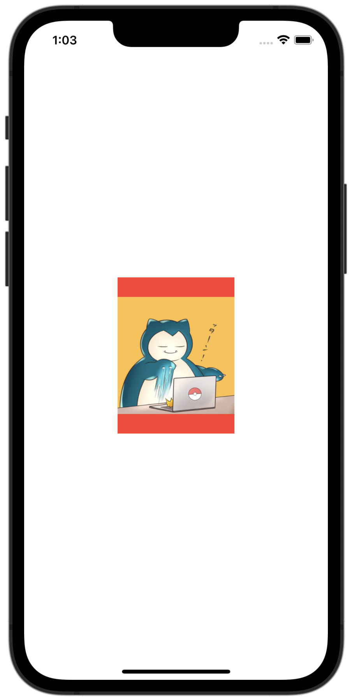
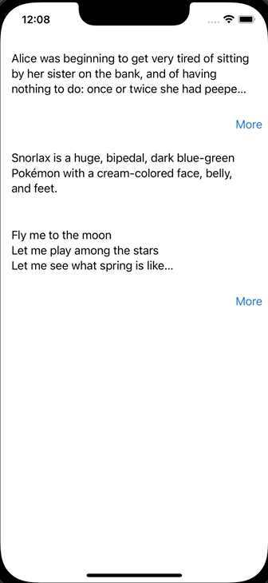
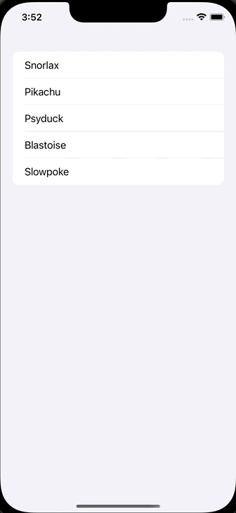
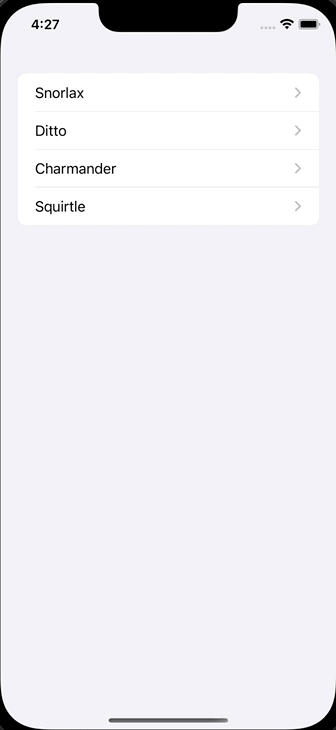

# SwiftUI100本ノック iOS16バージョン

SwiftUI（と関連知識）を習得するための100本ノックのiOS16バージョンです
「SwiftUIチュートリアルの次に何をすれば良いかわからない」という人向けに作ってみました。
もっと良い解答例があればコメントでどんどん教えてください m(_ _)m

Xcode Version 14.1
Swift version 5.7.1
シミュレーターはiPhone14でサイズはcommand+1のPhysical Size

## かんたん（SwiftUIの簡単な構文だけで実装可能）

### 1. 画像をリサイズして表示（fit）

150✖︎200サイズに画像をリサイズして表示させてください。
アスペクト比が異なる場合は余白を赤色で表示してください。

[解答](https://swiswiswift.com/2020-09-05/)

### 2. 画像をリサイズして表示（clip）

150✖︎200サイズに画像をリサイズして表示させてください。
アスペクト比が異なる場合ははみ出た箇所を切り取って表示してください。

[解答](https://swiswiswift.com/2020-09-06/)

参考
[【SwiftUI】画像（Image）の使い方](https://capibara1969.com/1861/)
[SwiftUIにおけるscaledToFill()とかscaledToFit()とかaspectRatio(_:contentMode:)等の使い分け](https://qiita.com/Riscait/items/71a9492314b8424274f1)

### 3. 画像を丸く切り取る

150✖︎150サイズに画像をリサイズし、丸く切り取って表示させてください。

[解答](????)

### 4. 画像を丸く切り取り、枠を付ける

150✖︎150サイズに画像をリサイズし、丸く切り取り、黒い枠を付けて表示させてください。

[解答](https://swiswiswift.com/2020-09-07/)

### 5. 画像を等間隔で横に並べる

画像を等間隔で横に並べてください。

[解答](https://swiswiswift.com/2020-09-08/)

### 6. NavigationViewを使いラージタイトルを表示する

NavigationViewを使いラージタイトルを表示してください。

[NavigationViewを使いラージタイトルを表示する](???)

### 7. Pickerを表示する

Pickerを使いポケモンを表示してください。

[解答](https://swiswiswift.com/2020-01-12/)

### 8. TabViewを使って画面を切り替える

TabViewを使って画面を切り替えてください。

[解答](https://swiswiswift.com/2019-11-21/)

### 9. Buttonが押されたら文字を変える

Buttonが押されたら文字を変えてください。

[解答](https://swiswiswift.com/2020-09-04/)

### 10. Listを使ってセクションごとに表示する

Listを使ってセクションごとに表示する

[解答](???)

### 11. 画面遷移時に値を渡す

画面遷移時に値を渡してください。

[解答](https://swiswiswift.com/2020-09-13/)

### 12. NavigationViewの戻るボタンを非表示にする

NavigationViewの戻るボタンを非表示にしてください。

[解答](???)

### 13. Listのスタイルを変更する

ListのスタイルをPlainListStyleに変更してください。

[解答](???)

### 14. アラートを表示する（その1）

iOS14以前でも使用できる方法でアラートを表示させてください。

[解答](https://swiswiswift.com/2019-12-20/)

### 15. アラートを表示する（その2）

iOS15以降で使用できる方法でアラートを表示させてください。

[解答](???)

### 16. アラートを出し分ける（その1）

ボタン1が押されたらアラート1を、ボタン2が押されたらアラート2を表示してください

[解答](???)

### 17. アラートを出し分ける（その2）

ボタン1が押されたらアラート1を、ボタン2が押されたらアラート2を表示してください。
iOS14以下でも使用できる方法です。

[解答](???)

### 18. Button内の画像やテキストの色を変えない

Buttonが押されたら文字を変えてください。
Button内の画像やテキストの色を変えないでください。

[解答](https://swiswiswift.com/2020-09-14/)

### 19. SwiftUIでアラートとシートを出し分ける

数字が入力されたらシートを表示してください。
数字以外が入力されたらアラートを表示してください。

[解答](https://swiswiswift.com/2020-09-03/)

### 20. NavigationLinkではなくButtonを押して画面遷移する

NavigationLink内のテキストではなく、Button内のテキストが押されたら画面遷移をしてください。

[解答](https://swiswiswift.com/2020-08-03/)

### 21. 続きを読む。。。ボタンがあるViewを実装する

SwiftUIで続きを読む。。。ボタンがあるViewを実装してください。

[解答](https://swiswiswift.com/2020-06-20/)

### 22. Text中の文字の太さや色を変える

Text中の文字の太さや色を変えてください。

[解答](https://swiswiswift.com/2020-06-22/)

### 23. FunctionBuilderを使ってViewに影をつける

FunctionBuilderを使ってViewに影をつけてください。

[解答](https://swiswiswift.com/2020-05-07/)

### 24. ViewModifierを使ってViewに影をつける

ViewModifierを使ってViewに影をつけてください。

[解答](https://swiswiswift.com/2020-05-06/)

### 25. リストを編集する

リストを編集してください。

[解答](https://swiswiswift.com/2019-12-17/)

### 26. リストのセルをタップするとアラートが表示させる

リストのセルをタップするとアラートが表示させてください。

[解答](https://swiswiswift.com/2019-12-18/)

### 27. 画面遷移先のViewから遷移元のメソッドを呼び出す

画面遷移先の View から遷移元のメソッドを呼び出してください。

[解答](https://swiswiswift.com/2020-01-11/)

### 28. ListViewからそれぞれ別のViewに遷移する

ListViewからそれぞれ別のViewに遷移する

[解答](https://swiswiswift.com/2019-11-20/)

### 29. 複数行のPickerを作成する

複数行のPickerを作成する

[解答](https://swiswiswift.com/2020-01-14/)

### 30. Sheetを表示する

Sheetを表示する

[解答](???)

### 31. 全画面でSheetを表示する

全画面でSheetを表示する

[解答](???)

### 32. NavigationBarを隠す

TextをNavigationViewの中に入れつつNavigationBarを表示しないでください

[解答](https://swiswiswift.com/2020-08-02/)

### 33. Previewを横向きにする

Previewを横向きにしてください。

[解答](https://swiswiswift.com/2020-08-04/)
TODO: 記事の内容が古いからコードに合わせて

## 34. 端末のシェイクを検知する

端末のシェイクを検知して@Stateを更新してください

[解答](https://swiswiswift.com/2020-11-01/)

### UICollectionViewのようにViewを並べる

UICollectionViewのようにViewを並べてください。

[解答](https://swiswiswift.com/2020-02-09/)

参考
[Q-Mobile/QGrid](https://github.com/Q-Mobile/QGrid)

### アプリ起動時に画面を遷移させる

アプリ起動時に画面を遷移させてください。

[解答](https://swiswiswift.com/2020-05-12/)

## むずかしい（UIKitや他のフレームワークが必要）

### よくあるチュートリアル画面をUIPageViewControllerとSwiftUIで作る

画像のような良くあるウェークスルー画面を実装してください。

[解答](https://swiswiswift.com/2020-06-28/)

### SwiftUIで閉じることができないモーダルを表示する

SwiftUIで閉じることができないモーダルを表示してください。

[解答](https://swiswiswift.com/2020-06-01/)

### SwiftUIでモーダルからフルモーダルを表示する

[解答](https://swiswiswift.com/2020-05-13/)

### フルスクリーンモーダルを表示する

フルスクリーンモーダルを表示してください。

[解答](https://swiswiswift.com/2020-05-05/)

iOS14では簡単に実装できるようになりました。

[解答](https://swiswiswift.com/2021-02-02/)

### 文字列中にタップ可能なリンクを追加する

文字列中にタップ可能なリンクを追加してください。

[解答](https://swiswiswift.com/2020-05-03/)

### GithubのAPIを叩き、リポジトリの情報をリストに表示する（Closure）

GithubのAPI( https://api.github.com/search/repositories?q=swift&sort=stars&page=1&per_page=30 )を叩きリポジトリの情報をリストに表示してください。
Closureを使用してください。

[解答](https://swiswiswift.com/2020-09-09/)

参考
[Infinite List Scroll with SwiftUI and Combine](https://www.vadimbulavin.com/infinite-list-scroll-swiftui-combine/)

### GithubのAPIを叩き、リポジトリの情報をリストに表示する（Combine）

GithubのAPI( https://api.github.com/search/repositories?q=swift&sort=stars&page=1&per_page=30 )を叩きリポジトリの情報をリストに表示してください。
Combineを使用してください。

[解答](https://swiswiswift.com/2020-09-10/)

参考
[Infinite List Scroll with SwiftUI and Combine](https://www.vadimbulavin.com/infinite-list-scroll-swiftui-combine/)

### GithubのAPIを叩き、リポジトリの情報をリストに表示する。一番下までスクロールされたら追加で取得してください。
GithubのAPI( https://api.github.com/search/repositories?q=swift&sort=stars&page=1&per_page=30 )を叩きリポジトリの情報をリストに表示してください。
一番下までスクロールされたら追加で取得してください。

[解答](https://swiswiswift.com/2020-09-11/)

参考
[Infinite List Scroll with SwiftUI and Combine](https://www.vadimbulavin.com/infinite-list-scroll-swiftui-combine/)

### GithubのAPIを叩き、リポジトリの情報をリストに表示する。一番下までスクロールされたら追加で取得してください。Indicator も表示してください。
GithubのAPI( https://api.github.com/search/repositories?q=swift&sort=stars&page=1&per_page=30 )を叩きリポジトリの情報をリストに表示してください。
一番下までスクロールされたら追加で取得してください。

[解答](https://swiswiswift.com/2020-09-12/)

参考
[Infinite List Scroll with SwiftUI and Combine](https://www.vadimbulavin.com/infinite-list-scroll-swiftui-combine/)

SwiftUIのTextFieldで編集中と編集完了を検知する
https://swiswiswift.com/2020-08-06/

SwiftUIでAppStorageを使ってUserDefaultの値を監視する
https://swiswiswift.com/2020-10-08/

SwiftUIでViewの上にViewを重ねる
https://swiswiswift.com/2020-11-06/

SwiftUIでMapを使う。Mapにピンを立てる
https://swiswiswift.com/2020-11-07/

SwiftUIでImageを長押しするとContextMenuを表示する
https://swiswiswift.com/2020-12-07/

SwiftUIを使ったTODOアプリのサンプル
https://swiswiswift.com/2020-12-10/

SwiftUIでAVAudioPlayerで音楽を再生し、再生終了を検知する
https://swiswiswift.com/2020-12-12/

SwiftUIでモーダルを表示する時に値を渡す
https://swiswiswift.com/2021-02-01/

SwiftUIでフルスクリーンモーダルを表示する（iOS14以上）
https://swiswiswift.com/2021-02-02/

SwiftUIで複数のモーダルをEnumで出し分ける
https://swiswiswift.com/2021-02-03/

@Stateと@Bindingの使い分け
https://swiswiswift.com/2021-02-05/

SwiftUIでBMIを計算し、結果を別のViewで表示する
https://swiswiswift.com/2021-02-06/

SwiftUIでボタンを押すとポップアップを表示する
https://swiswiswift.com/2021-02-07/

SwiftUIでアラートを入れ子にして使うことができない
https://swiswiswift.com/2021-02-09/

QGridを使ってCollectionViewを実装する
https://swiswiswift.com/2021-03-01/

SwiftUIでViewを横スクロールで表示する
https://swiswiswift.com/2021-03-02/

SwiftUIでButtonを有効にしたり無効にしたりする
https://swiswiswift.com/2021-03-04/

SwiftUIのTextFieldで表示するキーボードを指定する
https://swiswiswift.com/2021-03-07/

SwiftUIで初めの画面に遷移する（popToRootViewController）
https://swiswiswift.com/2021-03-09/

SwiftUIでシートを表示し、プッシュ遷移後にシートを閉じる
https://swiswiswift.com/2021-03-10/

SwiftUIでListをEditModeにして並び替える
https://swiswiswift.com/2021-04-02/

SwiftUIのListでSpacerの部分にもタップ判定をつける
https://swiswiswift.com/2021-04-07/

SwiftUIのListの中にボタンを複数設置する
https://swiswiswift.com/2021-04-08/

SwiftUIでSearchBar(TextField)を使って検索する
https://swiswiswift.com/2021-05-01/

SwiftUIでSearchBar(TextField)にクリアボタンをつける
https://swiswiswift.com/2021-05-02/

SwiftUIでUIActivityViewControllerを表示する
https://swiswiswift.com/2021-05-05/

SwiftUIでActivityIndicatorを表示する
https://swiswiswift.com/2021-05-06/

SwiftUIで少しカスタマイズしたActivityIndicatorを表示する
https://swiswiswift.com/2021-05-08/

SwiftUIでListにButtonを設定してパラメーターの違う画面に遷移する
https://swiswiswift.com/2021-05-09/

SwiftUIのTabViewのタブをコードから動的に切り替える
https://swiswiswift.com/2021-06-01/

Identifiableに適合していないStructでListを使う
https://swiswiswift.com/2021-07-02/

SwiftUIでカメラを使う
https://swiswiswift.com/2021-11-01/

SwiftUIでスライダーとスクロールを連動させる
https://swiswiswift.com/2021-11-02/

SwiftUIでPHPickerViewControllerを使って画像を選択する
https://swiswiswift.com/2021-11-09/

SwiftUIでMapViewの中央に十字を用意し、その中央の座標を取得する
https://swiswiswift.com/2021-12-05/

SwiftUIでMapViewを使い複数の位置情報を選択する
https://swiswiswift.com/2022-03-07/

SwiftUIで画像をピンチで拡大する（MagnificationGesture）
https://swiswiswift.com/2022-04-05/

SwiftUIで画像をピンチで拡大する（PDFView）
https://swiswiswift.com/2022-04-06/

SwiftUIで画像をピンチで拡大する（UIImageView + UIScrollView）
https://swiswiswift.com/2022-04-07/

iOSのファイルアプリ（UIDocumentPickerViewController）を開いてドキュメントフォルダに保存したファイルを開く
https://swiswiswift.com/2022-06-05/

SwiftUIでObservableObjectの@publishedなプロパティとBindingをする
https://swiswiswift.com/2022-06-06/

Swiftのasync,awaitを使ってAPIをフェッチする
https://swiswiswift.com/2022-06-15/

Swiftのasync,awaitを使ってAPIと画像を取得し、全てが揃ってから表示する
https://swiswiswift.com/2022-06-16/

SwiftUIでさまざまなデバイスのプレビューを確認する
https://swiswiswift.com/2022-01-03/