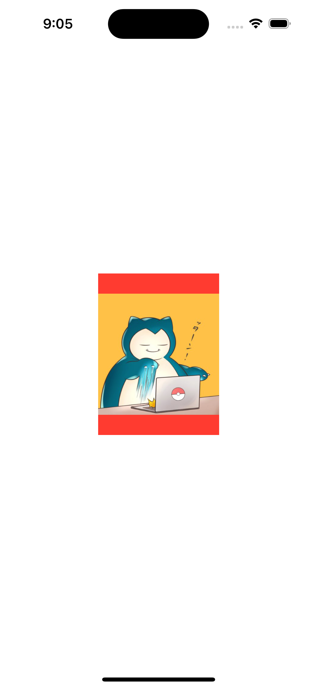

### 1. 画像をリサイズして表示（fit）
150✖︎200サイズに画像をリサイズして表示させてください。
アスペクト比が異なる場合は余白を赤色で表示してください。



<details><summary>解答例</summary>
<div>

```swift
import SwiftUI

struct ContentView: View {
    var body: some View {
        Image(.icon)
            .resizable()
            .aspectRatio(contentMode: .fit)
            .frame(width: 150, height: 200)
            .background(Color.red)
    }
}

#Preview {
    ContentView()
}
```

</div>
</details>


