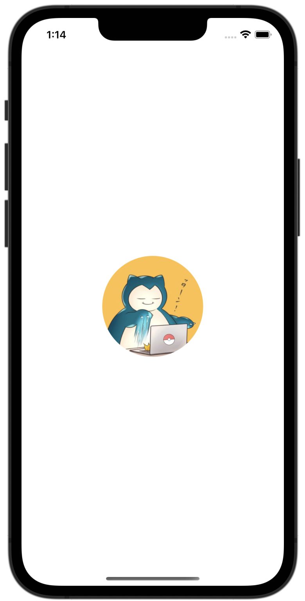
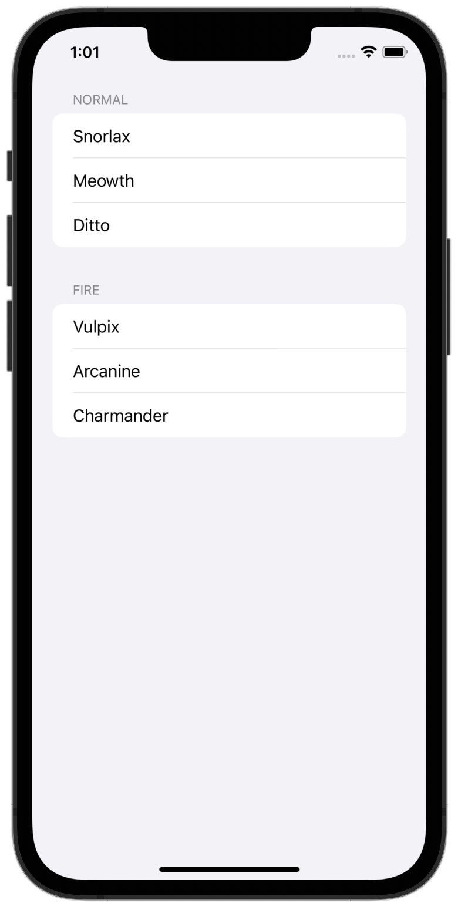
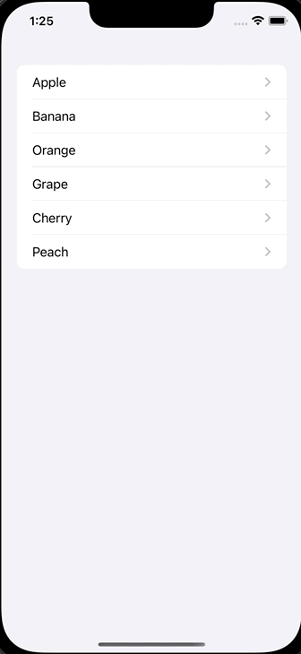
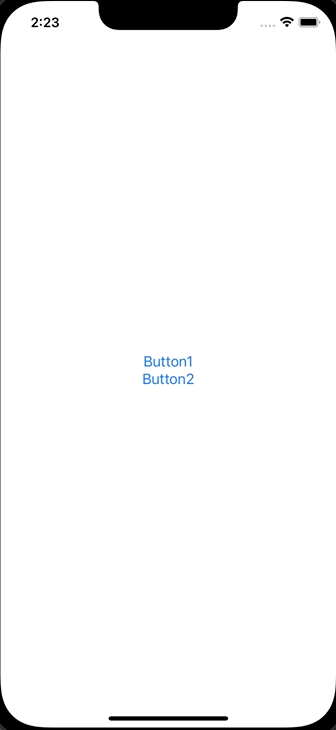
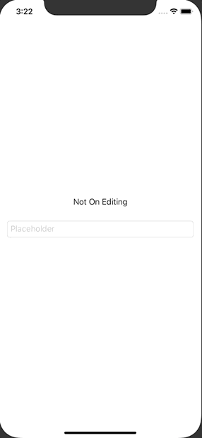

# SwiftUI100本ノック iOS16バージョン

SwiftUI（と関連知識）を習得するための100本ノックのiOS16バージョンです
「SwiftUIチュートリアルの次に何をすれば良いかわからない」という人向けに作ってみました。
もっと良い解答例があればコメントでどんどん教えてください m(_ _)m

難易度順には並んでいないですがなる早で難易度順に並べます。

Xcode Version 14.1
Swift version 5.7.1
シミュレーターはiPhone14でサイズはcommand+1のPhysical Size

## かんたん（SwiftUIの簡単な構文だけで実装可能）

### 3. 画像を丸く切り取る

150✖︎150サイズに画像をリサイズし、丸く切り取って表示させてください。

[解答](????)

### 6. NavigationViewを使いラージタイトルを表示する

NavigationViewを使いラージタイトルを表示してください。

[NavigationViewを使いラージタイトルを表示する](???)

### 10. Listを使ってセクションごとに表示する

Listを使ってセクションごとに表示する

[解答](???)

### 12. NavigationViewの戻るボタンを非表示にする

NavigationViewの戻るボタンを非表示にしてください。

[解答](???)

### 13. Listのスタイルを変更する

ListのスタイルをPlainListStyleに変更してください。

[解答](???)

### 15. アラートを表示する（その2）

iOS15以降で使用できる方法でアラートを表示させてください。

[解答](???)

### 16. アラートを出し分ける（その1）

ボタン1が押されたらアラート1を、ボタン2が押されたらアラート2を表示してください

[解答](???)

### 17. アラートを出し分ける（その2）

ボタン1が押されたらアラート1を、ボタン2が押されたらアラート2を表示してください。
iOS14以下でも使用できる方法です。

[解答](???)

### 30. Sheetを表示する

Sheetを表示する

[解答](???)

### 31. 全画面でSheetを表示する

全画面でSheetを表示する

[解答](???)

### 39. モーダルからフルモーダルを表示する

モーダルからフルモーダルを表示する

[解答](https://swiswiswift.com/2020-05-13/)

### 42. GithubのAPIを叩き、リポジトリの情報をリストに表示する（Closure）

GithubのAPIを叩き、リポジトリの情報をリストに表示する（Closure）

[解答](https://swiswiswift.com/2020-09-09/)

参考
[Infinite List Scroll with SwiftUI and Combine](https://www.vadimbulavin.com/infinite-list-scroll-swiftui-combine/)

### 43. GithubのAPIを叩き、リポジトリの情報をリストに表示する（Combine）

### 46. SwiftUIのTextFieldで編集中と編集完了を検知する

SwiftUIのTextFieldで編集中と編集完了を検知する

[解答](https://swiswiswift.com/2020-08-06/)

### 50. SwiftUIでMapを使う。Mapにピンを立てる

SwiftUIでMapを使う。Mapにピンを立てる

[解答](https://swiswiswift.com/2020-11-07/)

？？画像重複？

### 53. SwiftUIでAVAudioPlayerで音楽を再生し、再生終了を検知する

SwiftUIでAVAudioPlayerで音楽を再生し、再生終了を検知する

[解答](https://swiswiswift.com/2020-12-12/)

### 76. Identifiableに適合していないStructでListを使う

Identifiableに適合していないStructでListを使う

[解答](https://swiswiswift.com/2021-07-02/)

